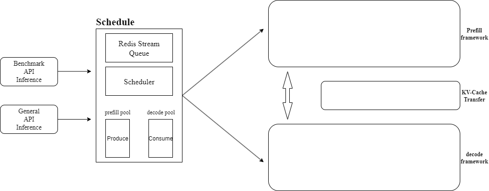

HPR 是一个基于 FastAPI 和 vLLM 构建的 LLM 推理系统。其主要目的是评估 LLM 基准测试。该系统提供了完整的基准测试评估 API 和性能监控系统。[欢迎各位使用HPR.](https://github.com/2Elian/HPR-VLLM/tree/v1.1-dev)

## 解决了什么问题

1. 将聊天推理与benchmark评估全部集成到一个系统中, 调用不同的接口即可完成想要做的事情, 无需启动多次. 
2. 集成了大多数benchmark的评估接口, 当评估不同的benchmark的时候, 无需每次加载模型浪费时间, 系统同时也支持热加载模型的方式.
3. 在推理中, 采纳了生产者-消费者的工程模式, 将prefill与decode隔离到不同的集群中, 采用异步队列最大化提升GPU利用率并提升并发能力!
4. 采纳了vLLM中的前缀缓存命中技术, 集成到生产-消费者的框架中, 设计了缓存交换机制, 以最大化利用前缀缓存与KV Cache缓存, 节省推理时间.

## 系统架构图

图1：架构设计示意图

## 技术细节

### 1. 接口与模型热加载详情

### 2. 生产者-消费者队列细节

### 3. 前缀缓存命中

### 4. 缓存交换

## 系统性能

本文从benchmark的评估时间与精度和lm-eval开源项目进行了对比，如下表