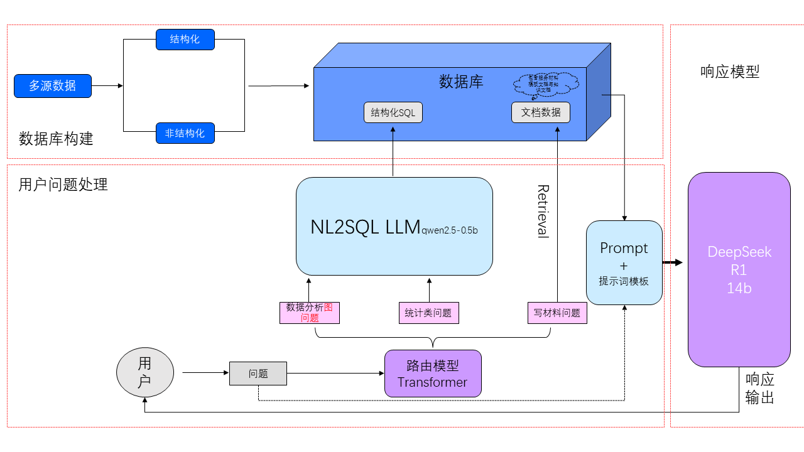
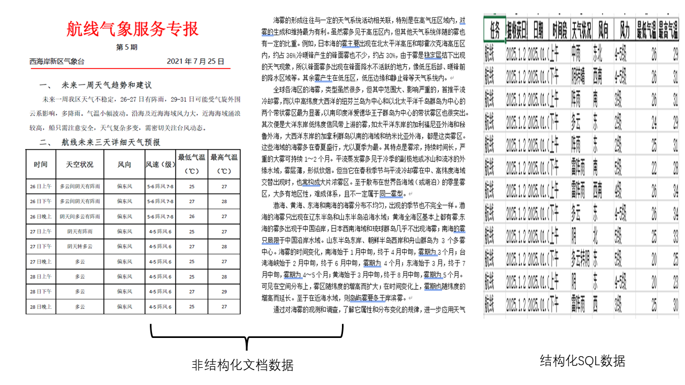
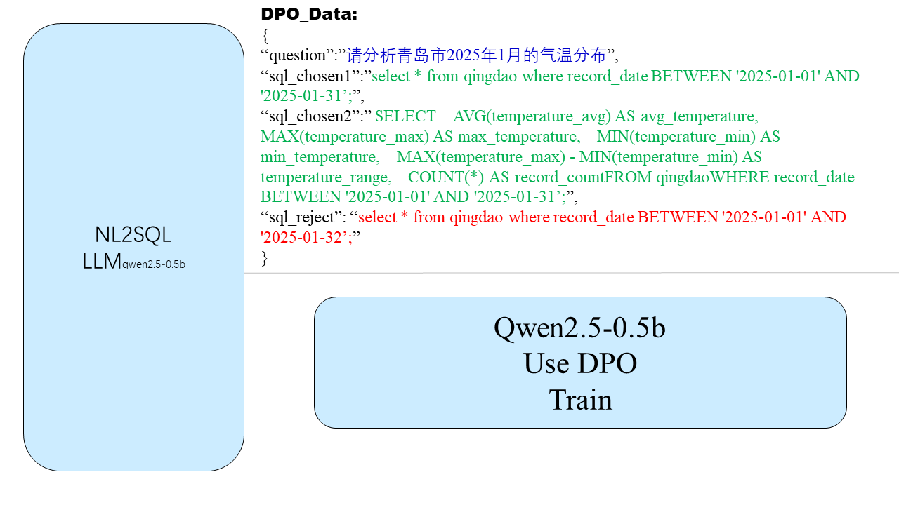
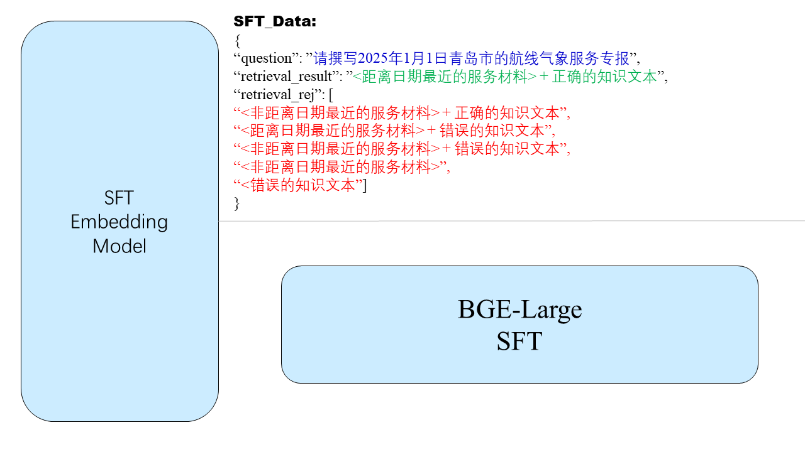
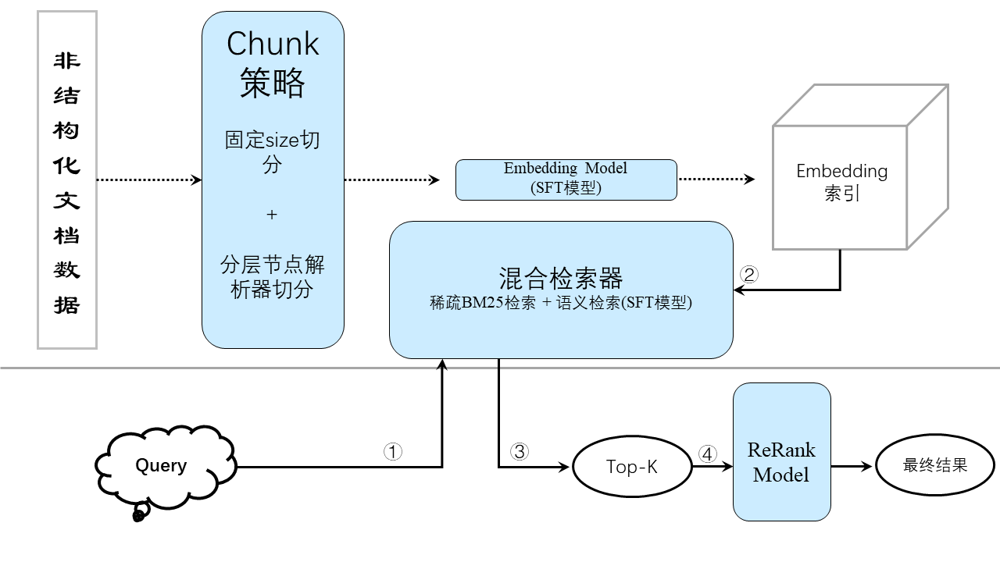

本项目旨在开发一款面向通用领域的智能服务材料撰写系统，通过整合RAG（检索增强生成）、NL2SQL（自然语言转SQL）及DeepSeek、Qwen大模型微调技术，解决传统人工撰写效率低、重复性高的痛点。系统采用多级向量数据库构建企业知识库，结合混合检索策略与动态路由机制，实现复杂查询的语义理解与精准信息提取；NL2SQL模块支持多表关联的自然语言交互，强化结构化数据处理能力；基于DeepSeek-R1的领域预训练与双阶段微调（指令微调+RLHF），显著提升生成文本的格式规范性与内容准确性。

## 算法架构
本项目的整体框架设计图如图1所示：

图1：架构设计示意图

它主要包含五个部分：路由模型、数据处理、NL2SQL模型、RAG框架、DeepSeek-R1模型.

路由模型我们采用了一个轻量的神经网络，将用户的问题针对业务化场景进行分类，在本项目中总共分成三类：生成数据分析图类、统计数据类、写材料类。路由模型将用户问题路由到不同的类别上，不同的任务类别会触发不同的模型进行后续的步骤.

在数据处理部分，我们将结构化的SQL数据和非结构化的文档数据分别进行处理。部分数据展示如图2所示：

图2：数据源示意图

对于结构化的数据而言，我们将它直接存入到MySQL数据库中，以便后续的查询使用。而非结构化的文档数据主要由两大部分组成：服务材料模板文档和相关领域的知识文档。非结构化数据需要搭配RAG进行检索，对于服务材料模板文档而言，每个文档的长度浮动较小，因此我们使用了一个固定大小的解析器对该部分数据进行切分。而相关领域的知识文档通常情况下大小不一，如果仍使用简单的固定长度切分的话，会丢失很多细节信息，从而导致RAG检索的精度大幅度下降。为了解决这个问题，本项目对相关领域的知识文档使用一个动态的节点解析器进行切分，其目的是将文档递归地分割为多层级的节点结构，每个层级使用不同的分块策略，并建立父节点与子节点之间的关系。(举个例子：输入文档 → 顶层分割（2048）→ 得到节点 A1, A2...--> A1 分割为子节点 B1, B2（512）→ 建立 A1-B1/B2 关系-->B1 分割为子节点 C1, C2（128）→ 建立 B1-C1/C2 关系，最终输出[A1, A2, B1, B2, C1, C2]（含关系指针）)

对于结构化的数据，我们需要进行SQL查询，进行数据的统计和聚合。为此，我们设计了一个NL2SQL模型，该模型可以将自然语言问题转换成SQL查询，查询到的数据将返回给大模型，大模型再进行分析返回给用户。对于NL2SQL模型而言，我们采用了Qwen2.5-0.5b进行DPO训练。为什么不选DeepSeek呢？这里我们尝试过使用DeepSeek-R1:1.5b来做，但由于R1模型的思考内容需进行后处理，模型难以得到干净的SQL查询，所以这部分我们最终还是选择Qwen2.5来做。为什么选择0.5b呢？主要是考虑到整个系统的响应时间以及资源消耗，对于自然语言转SQL查询而言，一个小的模型进行微调完全可以胜任。我们NL2SQL模型的训练过程可以在图3中看到。

图3：NL2SQL示意图

在RAG框架中，本项目针对业务化场景对Embedding模型进行了微调。其数据的构造与采用的模型架构如图4所示：

图4：Embedding模型微调示意图

此外，我们还在RAG框架中设计了混合检索器，它包含语义检索(微调后的Embedding模型)和稀疏检索。与单独的语义检索相比，混合检索的精度提升了10%左右。其RAG的整体流程如图5所示：

RAG框架示意图

## 实验分析

## 系统演示
