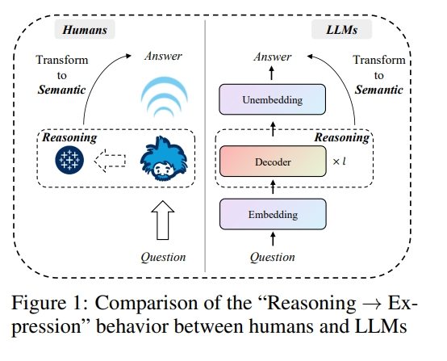

一篇非常有意思的工作：关于LLM haluucination detection。利用线性代数中直和分解的思想开展工作，将隐层状态分解成语义空间与推理空间的线性直和，再利用推理子空间的基向量作为haluucination的检测依据。

# 动机

引用原文的introduction的一句话，所谓的LLM幻觉就是：
hallucinations—i.e., model-generated information inconsistent with objective facts—remain a major obstacle to their deployment in critical
decision-making scenarios. 

作者认为大模型的 hallucination 问题和人类"说废话"的这种行为非常相似

具体来说，作者认为人类现实生活中思考问题的方式是：

1. 接收问题
2. 思考推理
3. 将思考推理转换成自然语言表述出来

转换成LLM就是：模型接收question，然后利用decoder层进行推理，再将最后的haddent state 投影到vocab space (对应图中的Unembedding层)，进行解码输出语义表达。

然而，人类即使语义表述有误，人类依然能从reasoning process进行回忆，改善自然语言表达。但是LLM却没有这个能力，因为LLM在Unembedding层投影之后，输出的space是语义空间而不是推理空间。

所以作者认为：achieving high-precision hallucination detection in LLMs
requires placing greater emphasis on the reasoning information encoded within the hidden states, rather than primarily
on the semantic content of the outputs

# 创新点

分解最后一层的hidden state到semantic subspace and the reasoning subspace。

The semantic subspace captures the linguistic information of
the generated content, while the reasoning subspace reveals the model’s internal reasoning process.

As illustrated in
Figure 1, comparing humans and LLMs “Reasoning → Expression” behaviors reveals that LLMs discard reasoning
information in the Unembedding layer while compressing semantic information into generated tokens. This suggests
that the Unembedding layer inherently distinguishes between semantic and reasoning information. 作者认为：本来的hidden state是包含语义信息和推理信息的，但是Unembedding层映射完之后，就只剩下语义信息了，因此Unembedding层本质上具有区分语义和推理信息的能力。

所以，作者就想在hidden state 进入Unembedding层之前，就把hidden state分解成两个子空间，让语义子空间的信息进入Unembedding，推理子空间的信息留作用于检测hallucination。具体操作就是对hidden state做SVD分解，使得semantic and reasoning subspace 相互正交，也就是线性代数里面的直和分解。

此外，the reasoning subspace basis vectors account for only about
5% of the hidden state dimension，这个操作是因为可以过滤掉reasoning subspace的噪声信息。

