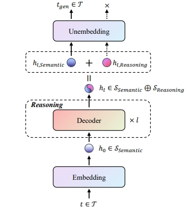

This paper introduces a novel reward model training method, specifically an application of linear direct sum decomposition and SVD decomposition, which separates the inference space from the latent space to train the reward.

My idea come from: https://arxiv.org/pdf/2509.11536

# motivation

I deem that the way people think problems in real life:

1. receive the problems
2. thinking and reasoning
3. convert thinking and reasoning into natural language

Converting to LLM means: the model receives the question, then uses the decoder layer for reasoning, and then projects the final haddent state into the vocab space for decoding and outputting semantic expression.

Even if humans make mistakes in semantic expression, they can still recall the reasoning process and improve their natural language expression. However, LLM does not have this ability because after the projection of the Unembedding layer, the output space of LLM is the semantic space rather than the reasoning space.

So I think the accuracy of the reward model should be closely related to reasoning and not much related to semantics.

# how to do?

An LLM with COT capabilities performs semantic understanding and learning at the shallow level, and acquires reasoning capabilities in deep learning. However, the LM head at the final layer maps the hidden state to the vocab_size size. This means that the hidden state at the final layer is completely converted into semantic information and output as natural language that humans can understand.

The current mainstream training method for reward models is to remove the last layer's LM head and directly map the hidden state of the last layer to a one-dimensional matrix to obtain the sequence score. However, I believe that the hidden state contains both semantic and inference information, and the score of a sequence should be closely related to the inference information (because inference information is denser), while the semantic information acts as noise and affects the actual score.

Now, the question is how to decompose the hidden state into the sum of semantic information and reasoning information? In other words, how to separate the reasoning information from the hidden state?

As mentioned earlier, the hidden state contains both semantic and reasoning information. After passing through the LM head, only the semantic information remains, and the reasoning information is lost. This process can be expressed as the following mathematical formula:

$$W_{UnEmbed}H_{l}\approx W_{UnEmbed}H_{S}$$

$$W_{UnEmbed}H_{R}\approx 0$$

where, $W_{UnEmbed}$ is LM head weight, and $H_{l}, H_{S}, H_{R}$ represent hidden state, semantic information, and reasoning information respectively.

然后从SVD分解出发，可以推导出，直和。然后再利用HARP的技巧进行训练即可。

# Training details

# conclusion